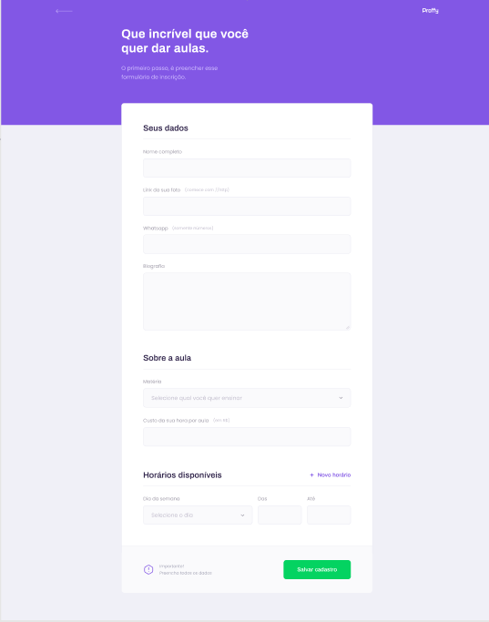
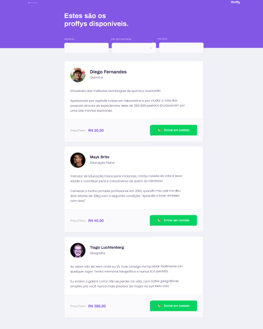

# Proffy - Next Level Week

<h1 align="center">
    
</h1>


## 🖥 Preview 

<p align="center">
  
</p>

<p align="center">
  
</p>

<p align="center">
  
</p>


---

## 📖 Sobre 

Este é um projeto desenvolvido durante a **[Next Level Week](https://nextlevelweek.com/)**, realizada pela **[@Rocketseat](https://github.com/Rocketseat)** durante os dias 3 a 9 de Agosto de 2020.

A proposta do projeto é uma aplicação que possa ligar quem deseja aprender, e quer ensinar. É possível encontrar alunos para selecionar, ou encontrar o professor para aquela matéria que você sempre quis aprender mais! Sem que haja nenhuma limitação de área!!

---

<b>Pergunta:</b> Sobre o que é o projeto?

<b>Resposta:</b> A proposta do projeto é uma aplicação que possa ligar quem deseja aprender, e quer ensinar. É possível encontrar alunos para selecionar, ou encontrar o professor para aquela matéria que você sempre quis aprender mais! Sem que haja nenhuma limitação de área!! <br>
<b>Resposta:</b> O NLW é uma semana prática com muito código, desafios e networking desenvolvido pela RocketSeat.<br>
<b>Pergunta:</b> Quais são as tecnologias usadas neste projeto?<hr>

<b>Resposta:</b> As tecnologias usadas neste projeto são...

✅ HTML 5 <br>
✅ CSS 3<br>
✅ JavaScipt<hr>

## Ferramentas utilizadas

- JavaScript
- HTML
- CSS
- Node.js
- Nunjucks
- Express 
- [Figma](https://www.figma.com/file/GHGS126t7WYjnPZdRKChJF/Proffy-Web)

---

## 🚀 Como rodar o projeto

Podemos considerar este projeto como sendo divido em duas partes:

1. Front End (past src)
2. Back End (em construção)

### Pré-requisitos

Antes de começar, você vai precisar ter instalado em sua máquina as seguintes ferramentas:
[Git](https://git-scm.com), [Node.js](https://nodejs.org/en/).
Além disto é bom ter um editor para trabalhar com o código como _VSCode_


### Rodando a aplicação web (Front End)

```bash
# Clone este repositório
$ git clone https://github.com/DanielFreitasFerreira/proffy

# Acesse a pasta do projeto no seu terminal/cmd
$ cd proffy

# Vá para a pasta da aplicação Front End
$ cd src/server.js

# Instale as dependências
$ npm install

# Execute a aplicação em modo de desenvolvimento
$ npm run dev

# Ou use Yarn se preferir
$ yarn dev

# A aplicação será aberta na porta:3333 - acesse http://localhost:5500
```
## 🤔 Como contribuir

- Faça um fork desse repositório;
- Cria uma branch com a sua feature: `git checkout -b minha-feature`;
- Faça commit das suas alterações: `git commit -m 'feat: Minha nova feature'`;
- Faça push para a sua branch: `git push origin minha-feature`.

Depois que o merge da sua pull request for feito, você pode deletar a sua branch.

```

$ git branch -d nome_da_branch

```

## 🙌 Agradecimentos

- [Time da Rocketseat](https://rocketseat.com.br/)
- [Mayk Brito, e Instrutor da Rocketseat](https://github.com/maykbrito)
- [Diego Fernandes, CTO e Instrutor da Rocketseat](https://github.com/diego3g)

---

<p style="text-align: center;">Desenvolvido com 💜 por Daniel Freitas Ferreira</p>